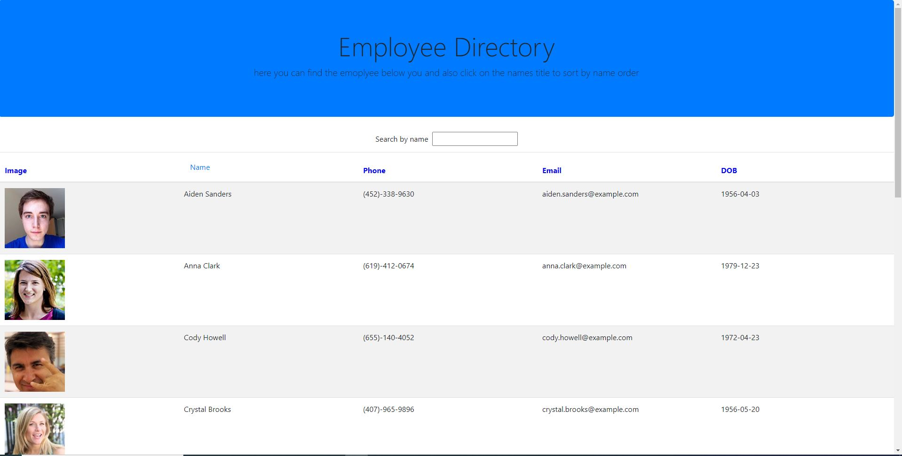

# budget tracker
I have created a employee directory app using react. This app pulls randoms users from the Random User API and lets you view their data. The user is also able to search through the search bar or they can sort users by clicking their name.
# Installation
You will need to "npm install" to get all the npm packages and dependencies

[User Story](#User-Story)

[Project Screenshots](#Project-Screenshots)

[Deployed App](#Deployed-App)

[License](#license)

## User Story

As a user, I want to be able to view my entire employee directory at once so that I have quick access to their information.

## Project Screenshots

## Deployed App

Deoplyed App Link : https://amankmr4.github.io/employee-directory/

## License

You can refer to the licenses used in this project in the license file [here](/license.md)

### Author

Aman Kumar

Email: aman.kmr4@yahoo.com
